# Лабораторная работа №1: Асимптотическая сложность
## 1. Поиск

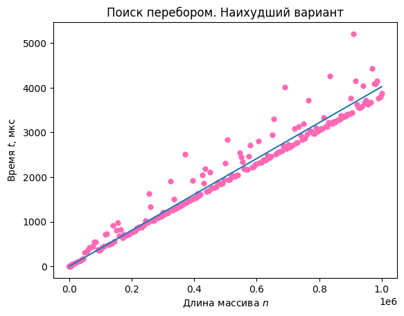

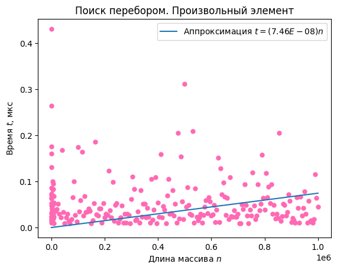
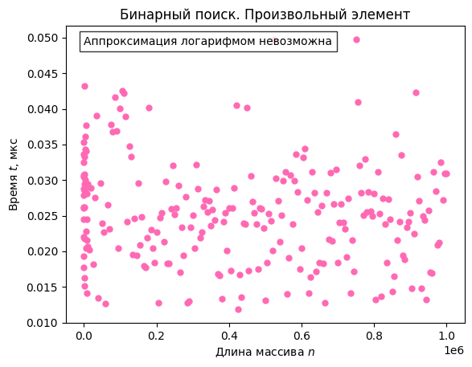

Прямые измерения времени выполнения программы подтвердили, что алгоритм поиска элемента перебором имеет асимптотическую сложность $O(n)$, алгоритм бинарного поиска для упорядоченного массива $-$ $O(\log(n))$.

## 2. Сумма

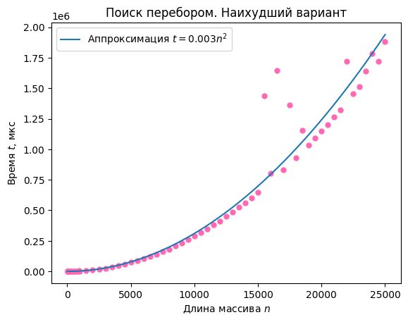
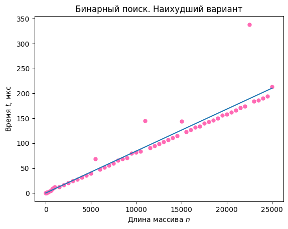

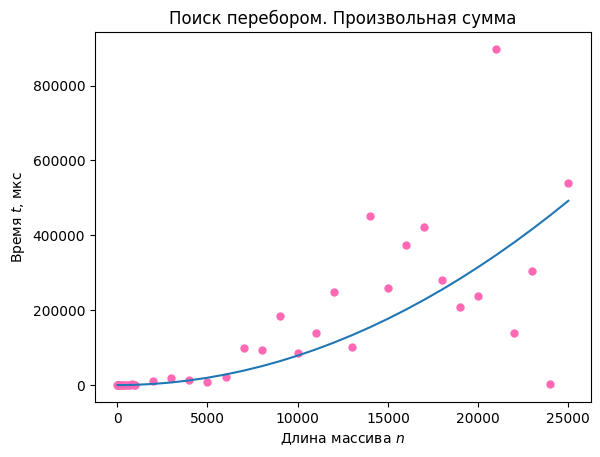
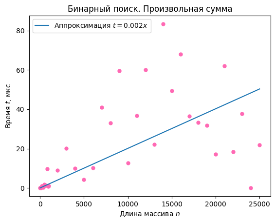

Прямые измерения времени выполнения программы подтвердили, что алгоритм поиска элемента перебором имеет асимптотическую сложность $O(n^2)$, алгоритм бинарного поиска для упорядоченного массива $-$ $O(n)$.

## 3. Часто используемый элемент

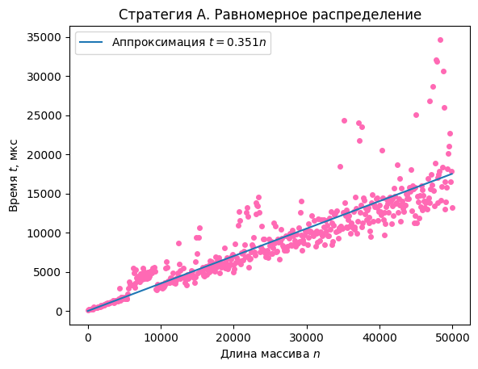
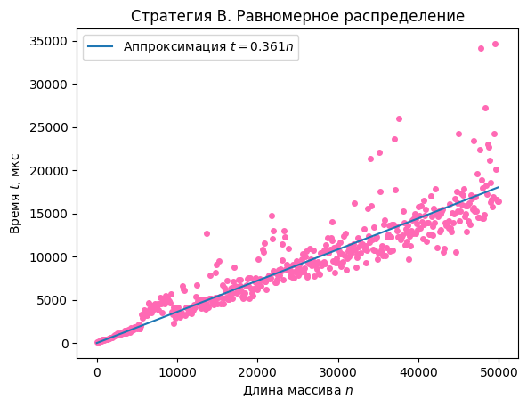
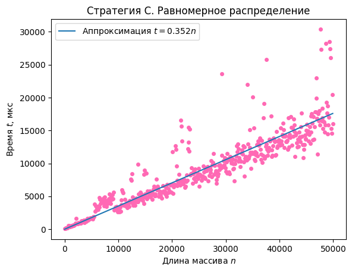

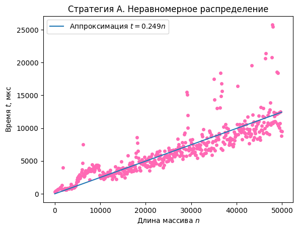
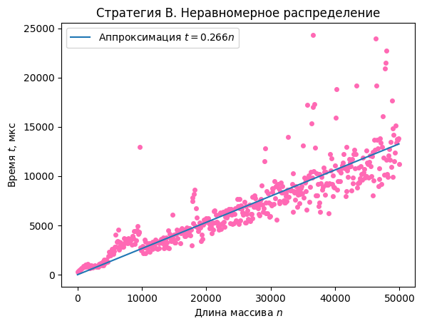
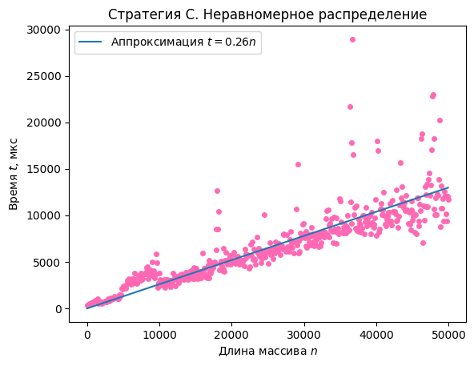

Алгоритмы A, B, C имеют линейную асимптотическую сложность, так как перемещения элементов не сильно влияют на общую производительность (использовался поиск перебором). Угловые коэффициенты наклона графиков показывают, что в среднем $t_A<t_C<t_B$ для обоих видов распределения запросов. Кроме того, время при неравномерном распределении запросов меньше, чем в при равномерном.