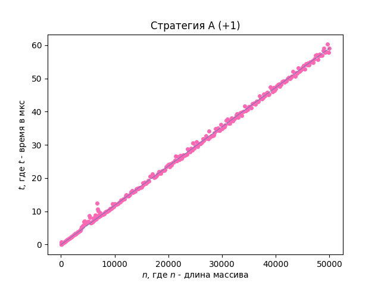
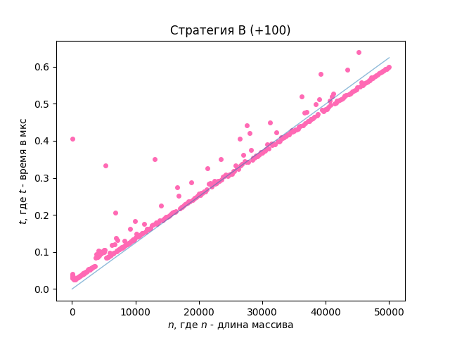
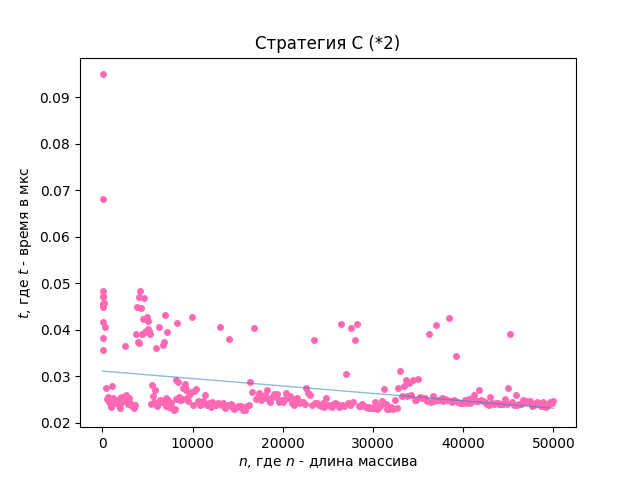

# Лабораторная работа №1: Асимптотическая сложность
## 1. Увеличивающийся буфер

Прямые измерения времени выполнения программы показали, что алгоритмы добавления элемента при увеличении выделенной памяти на константу имеют асимптотическую сложность $\approx$ $O(n)$, алгоритм с удвоением памяти $\approx$ $O(1)$. Среднее время выполнения программ связано соотношением: $t_{*2}<t_{+100}<t_{+1}$.

## 2. Очередь

Прямые измерения времени выполнения программы показали, что алгоритмы добавления и извлечения элемента имеют асимптотическую сложность $O(n)$.